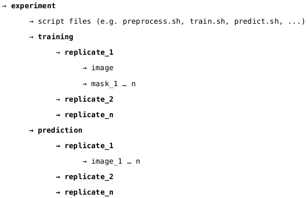

# Segementation (foreground/background) tutorial

This tutorial shows a detailed analysis workflow description for the first application example. It describes the
general procedure to perform a foreground/background segmentation using a supervised classification approach. The workflow includes the following steps:

* Creation of training data
* Data preparation (create folder structure)
* Script adaptation for training and prediction

This guide provides an exemplary overview about the general procedure and the main components (commands) for solving a common segmentation task. For a detailed understanding it is recommended to become familiar with the provided application examples by studying the given example pipeline-scripts.

## Input data

For the including analysis utilizing illustration of the example workflow a top-view image an 'arabidopsis thaliana' plant is used. The goal of the is to generate a foreground/background segmentation a supervised classification approach.

The example data and used plant images within the documentation are from:

http://www.plant-phenotyping.org/CVPPP2014-challenge

Please cite this paper if you use this data for your research:

Hanno Scharr, Massimo Minervini, Andreas Fischbach, Sotirios A. Tsaftaris.
Annotated Image Datasets of Rosette Plants. Technical Report No. FZJ-2014-03837,
Forschungszentrum Jülich, 2014).

## Data preparation

### Training-data preparation
A supervised classification use training data to create a model which includes some knowledge to predict the un- classified data. First samples for foreground and background have to be created utilizing an image editing software e.g. GIMP (http://www.gimp.org/). The following illustrations show the common proceed, it is sufficient to highlight only a few spots of the foreground and background regions (see illustration below). The labeled images could be named as mask_1 ... n.png.

### Creating folder structure
The underlying folder structure is not strict designed, it depends on the utilized scripts. Here the structure used in the application examples is recommended. This exemplary structure looks like this:

For generation of the sub folder structure some scripts are provided, e.g. move_all_to_subdir.sh can be used to move all replicate images (which may be stored together into one folder) into its belonging sub-folder.

Training

